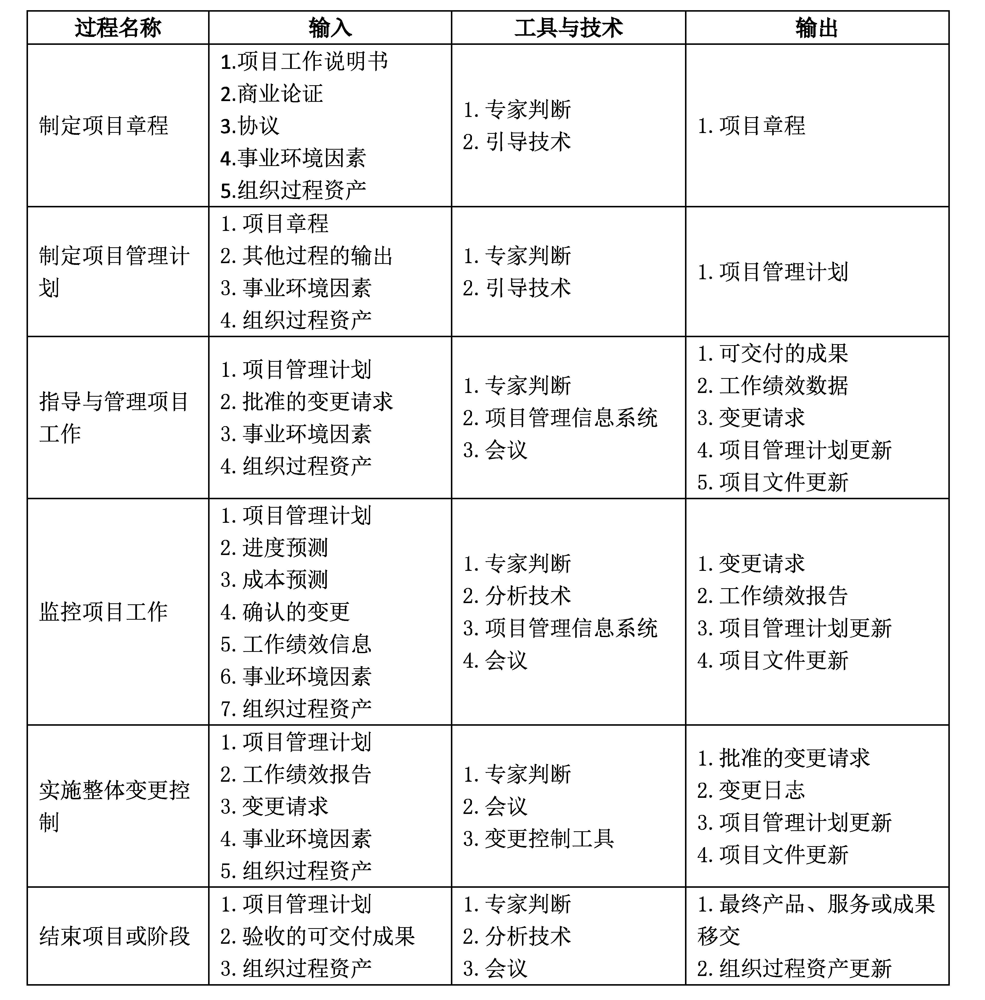

# 第4章 项目整体管理

- 整体管理过程说明
  + 制定项目章程：编写一份正式文件的过程，这份文件就是项目章程。通过发布项目章程，正式地
批准项目并授权项目经理在项目活动中使用组织资源。
  + 制定项目管理计划：定义、准备和协调所有子计划，并把它们整合为一份综合项目管理计划的过
程。项目管理计划包括经过整合的项目基准和子计划。
  + 指导与管理项目工作：为实现项目目标而领导和执行项目管理计划中所确定的工作，并实施已批
准变更的过程。
  + 监控项目工作：跟踪、审查和报告项目进展，以实现项目管理计划中确定的绩效目标的过程。
  + 实施整体变更控制：审查所有变更请求，批准变更，管理对可交付成果、组织过程资产、项目文
件和项目管理计划的变更，并对变更处理结果进行沟通的过程。
  + 结束项目或阶段：完成所有项目管理过程组的所有活动，以正式结束项目或阶段的过程。
- 项目章程是正式批准项目的文件。由千项目章程要授权项目经理在项目活动中动用组织的资源，
所以，项目经理任何时候都应在规划开始之前被委派，鼓好是在制定项目章程之时。
项目章程是由项目实施组织外部签发的，项目签发章程之后，就建立了项目与组织日常工作之间的
联系。对千某些组织，只有在完成了分别启动的需求估计、可行性研究、初步计划或其他有类似
作用的分析之后，才正式为项目签发项目章程并加以启动。制定项目章程基本上就是将业务需求、
上项目的理由、当前对顾客要求的理解，以及用来满足这些要求的产品、服务或成果形成文件。项
目章程应当包括以下内容（直接列入或援引其他文件）：
  + 项目目的或批准项目的原因。
  + 可测晕的项目目标和相关的成功标准。
  + 项目的总体要求。
  + 概括性的项目描述。
  + 项目的主要风险。
  + 总体里程碑进度计划。
  + 总体预算。
  + 项目审批要求（用什么标准评价项目成功，由谁对项目成功下结论，由谁来签署项目结束）。
  + 委派的项目经理及其职责和职权。
  + 发起人或其他批准项目章程的人员的姓名和职权。
- 项目章程的作用
  + 确定项目经理，规定项目经理的权力。
  + 正式确认项目的存在，给项目一个合法的地位。
  + 规定项目的总体目标，包括范围、时间、成本和质址等。
  + 通过叙述启动项目的理由，把项目与执行组织的日常经营运作及战略计划等联
系起来。
- 工作说明书说明：
  + 业务需求：一个组织的业务需求可能是培训、市场需求，技术进步，法律需求或政府的标准等。
  + 产品范围说明书： 项目创造的产品或服务要求与特征的文件。通常，产品需求在项目启动时并不
是很详细，在后续的过程中随着产品特性的明晰会被逐渐细化。这些需求也要记录项目所创造的产
品或服务与业务需求或其他刺激因素之间的关系。虽然产品需求文档的形式和实质内容各不相同，
但它的详细程度应该足够支持后续的项目规划。
  + 战略计划：所有项目都要支持组织的战略目标，执行组织要把战略计划作为项目选择的一个要素
来考虑。
- 事业环境因素
在制订项目章程时，必须考虑和项目成功息息相关的环境和组织因素。如下所述：
  + 组织或公司的文化与组成结构。
  + 政府或行业标准（如管理部门的规章制度、产品标准、质量标准与工艺标准）。
  + 基础设施（如现有的软件与硬件基础设施）。
  + 现有的人力资源（如技能、专业与知识；例如设计、开发、法律、合同发包与采购）。
  + 人事管理（如雇用与解雇指导方针、员工业绩评价与培训记录）。
  + 公司工作核准制度。
  + 市场情况。
  + 项目干系人风险承受力。
  + 商业数据库（如标准的成本估算数据、行业风险研究信息与风险数据库）。
  + 项目管理信息系统（如自动化工具套件，例如进度管理软件工具、配置管理系统、信息收集与分
发系统，或者与其他在线自动化系统的连网接口）。项目管理信息系统(PMIS) 是在组织内部使用
的一套系统集成的标准自动化工具。
【2018 年11 月第37 题】
- 组织过程资产，可以归纳为如下两
1. 组织进行工作的过程与程序。
  + 组织标准过程，如标准、方针（安全健康方针，项目管理方针）；软件生命周期与项目生命期，以
及质量方针与程序（过程审计、目标改进、核对表，以及供组织内部使用的标准过程定义）。
  + 标准指导原则、工作指令、建议评价标准与实施效果评价准则。
  + 模板（如风险模板、工作分解结构模板与项目进度网络图模板）。
  + 根据项目的具体需要修改组织标准过程的指导原则与准则。
  + 组织沟通要求（如可利用的特定沟通技术，允许使用的沟通媒介、记录的保留， 以及安全要求）。
  + 项目收尾指导原则或要求（如最后项目审计、项目评价、产品确认，以及验收标准）。
  + 财务控制程序（如进度报告、必要的开支与支付审查、会计编码，以及标准合同条文）。
  + 确定问题与缺陷控制、问题与缺陷识别和解决，以及行动追踪的问题与缺陷管理程序。
  + 变更控制程序，包括修改公司正式标准、方针、计划与程序，或者任何项目文件，以及批准与确
认任何变更时应遵循的步骤。
  + 风险控制程序，包括风险类型、概率的确定与后果，以及概率与后果矩阵。
  + 批准与签发工作授权的程序。
2. 组织整体信息存储检索知识库。
  + 过程测量数据库，用千搜集与提供过程与产品实测数据。
  + 项目档案（如范围、费用、进度，以及质量基准、实施效果测量基准、项目日历、项目进度网络
图、风险登记册、计划的应对行动，以及确定的风险后果）。
  + 历史信息与教训知识库（如项目记录与文件，所有的项目收尾资料与文件记录， 以前项目选择决
策结果与绩效的信息；以及风险管理努力的信息）。
  + 问题与缺陷管理数据库，包括问题与缺陷状态，控制信息，问题与缺陷解决和行动结果。
  + 配置管理知识库，包括公司所有正式标准、方针、程序和任何项目文件的各种版本与基准。
  + 财务数据库，包括如工时、发生的费用、预算以及任何项目费用超支等信息
- 项目目标
  + 目标应该是具体的、可度量的、可达到的、与企业战略目标相关的和有时间限制的。
  + 成果目标和约束目标之间经常发生矛盾，甚至发生冲突；
  + 项目目标要址化
  + 项目通常有多个目标
【2018 年5 月第35 题】
- 项目启动会议
1. 确定会议目标。项目启动会议的具体目标包括建立初始沟通、相互了解、获得支持、对项目
方案达成共识等。
2. 做好会议前的准备工作。它包括审阅项目文件、召开预备会议、明确关键问题、编制初步计划、编制人员和组织计划、开发团队工作环境、准备会议材料等。
3. 明确并通知参加会议的人员。典型的项目启动会议都是由项目经理作为项目主持人，参加的
人员有项目委托人、组织的高层领导、客户的项目经理、客户部门的负责人、职能部门经理及项
目全体人员。
4. 明确会议的主要议题。它包括采用的项目开发过程、项目产品、项目资源和进度、项H 管理
系统及下一步的工作等。
5. 做好记录。项目启动大会，一定要作好记录，这些记录可以很好地给自己留存一个档案。
- 项目管理计划的内容（官方教材第三版P202 及结合说明整理）
### 一、计划过程组的各个计划子过程的全部成果
  + 项目管理团队选择的各个项目管理过程。
  + 每一选定过程的实施水平。
  + 对实施这些过程时使用的工具与技术所做的说明。
  + 在管理具体项目中使用选定过程的方式和方法，包括过程之间的依赖关系和相互作用，以及重要
的依据和成果。
  + 为了实现项目目标所执行工作的方式、方法。
  + 监控变更的方式、方法。
  + 实施配置管理的方式、方法。
  + 使用实施效果测晕基准并使之保持完整的方式、方法。
  + 项目干系人之间的沟通需要与技术。
  + 选定的项目生命期和多阶段项目的项目阶段。
  + 高层管理人员为了加快解决未解决的问题和处理未做出的决策，对内容、范围和时间安排的关键
审查。
### 二、多个分计划（或辅助计划）。这些分计划包括但不限千：
  + 范围管理计划
  + 需求管理计划
  + 进度管理计划
  + 成本管理计划
  + 质量管理计划
  + 过程改进计划
  + 人力资源管理计划
  + 沟通管理计划
  + 风险管理计划
  + 采购管理计划
  + 千系人管理计划
其他组成部分可以包括这些内容：里程碑清单、资源日历、进度基准、成本基准、质量基准、风
险登记册等。
【2018 年5 月第34 题】【2018 年11 月第35 题】
- 指导和管理项目执行的行动（或内容）
  + 开展活动实现项目目标。
  + 付出努力与资金，实现项目目标。
  + 配备、培训并管理分派到本项目上的项目团队成员。
  + 根据具体情况取得报价、标书、要约或建议书。
  + 在潜在的卖方中间进行比较，选定卖方。
  + 取得、管理并使用资源，包括材料、工具、设备与设施。
  + 实施已列入计划的方法和标准。
  + 创造、控制、核实并确认项目可交付成果。
  + 管理风险并实施风险应对活动。
  + 管理卖方。
  + 将批准的变更纳入项目的范围、计划和环境。
  + 建立并管理项目团队内外的项目沟通渠道。
  + 收栠项目数据并报告费用、进度、技术与质最绩效，以及有助千预测的状态信息。
  + 收栠与记载吸取的教训，并实施批准的过程改进活动。
- 变更控制过程：
  + 先沟通然后提出变更申请，应采用书面方式
  + 充分评估变更的影响，包括对范围、成本、进度、质匿等方方面面的影响，将评估结果通知干系
人
  + 按规定变更流程，由CCB 进行审批
  + 变更审批未通过则取消变更，纳入监控；
  + 变更审批通过则调整和更新相应的项目计划及文件，并通知干系人
  + 根据要求执行变更、记录变更实施情况
  + 验证变更，归档等。
- 整体变更控制过程包括下列变更管理活动，这些活动的详细程度由项目执行的完成情况决定。
  + 确定是否需要变更或者变更是否已经发生。
  + 对妨碍整体变更控制的因素施加影响，保证只实施经过批准的变更。
  + 审查和批准请求的变更。
  + 控制申请变更的流程，在发生变更时管理批准的变更。
  + 仅允许被批准的变更纳入到项目产品或服务之中，维护基准的完整，并维护项目产品或服务有关
的配置与规划文件。
  + 审查与批准所有的纠正与预防措施建议。
  + 根据批准的变更控制与更新范围、成本、预算进度和质量要求，协调整个项目的变更。例如，提
出的进度变更通常会影响到成本、风险、质晕与人员配备。
  + 将请求的变更的全部影响记录在案。
  + 确认缺陷补救。
  + 根据质量报告并按照标准控制项目质歌。
- 在整个项目范围内的应用配置管理系统，包括变更控制各过程，以实现如下3 个主要目标。
  + 建立一种方法始终如一地识别与提出对既定基准的变更，并估计这些变更的价值与有效性。
  + 通过考虑每一项变更的影响，不断地确认与改进项目的机会。
  + 为项目管理团队提供将所有的变更始终如一地通知项目干系人的机制。
- 整体变更控制过程中的几个配置管理活动如下。
  + 配置识别。是确定与核实产品配置、标识产品与文件、管理变更，以及保持信息公开的基础。
  + 配置状态记录。捕捉、存储和评价有效地管理产品和产品信息所需的配置信息。
  + 配置核实与审计。查明配置文件中确定的性能与功能要求已经达到。
- 整体变更控制的综合说明（来自中级教材第二版P259-260), 是关千变更非常重要的说明。高级
考的可能性一样很大，必须认真掌握：
  + 实施整体变更控制过程贯穿项目始终，并且应用千项目的各个阶段。
  + 项目经理对此负最终责任。
  + 对千项目管理计划、项目范围说明书和其他可交付成果需要通过谨慎、持续地变更管理。应该通
过否决或批准变更，来确保只有经批准的变更才能纳入修改后的基准中。项目计划一经批准，就成
为项目执行和考核的基准，也只有经过规定的变更程序才能做出修改。该程序包括：提交正式的变
更请求，对变更及其影响做出综合评价，批准或否决变更。
  + 项目的任何干系人都可以提出变更请求。
  + 尽管可以口头提出，但所有变更请求都必须以书面形式记录，并纳入变更管理以及配置管理系统
中。变更请求应该由变更控制系统和配置控制系统中规定的过程进行处理。应该评估变更对时间和
成本的影响，并向这些过程提供评估结果。
  + 每项记录在案的变更请求都必须由一位责任人批准或否决，这个责任人通常是项目发起人或项目
经理。应该在项目管理计划或组织流程中指定这位责任人。
  + 必要时，应该由变更控制委员会(CCB) 来决策是否实施整体变更控制过程。CCB 是一个正式组成
的团体，负责审查、评价、批准、推迟或否决项目变更，以及记录和传达变更处理决定。
  + 变更请求得到批准后，可能需要制订新的（或修订的）成本估算、活动排序、进度日期、资源需
求和风险应对方案分析。这些变更可能要求调整项目管理计划和其他项目文件。变更控制的实施
程度，取决千项目所在应用领域、项目复杂程度、合同要求，以及项目所处的背景与环境。
  + 某些特定的变更请求，在CCB 批准之后，还可能需要得到客户或发起人的批准，除非他们本来就
是CCB 的成员。
  + 整体变更控制可以通过变更控制委员会和变更控制系统来完成，但是，整体变更控制不只是变更
控制委员会的事情，也是项目经理和项目团队的事情。原因如下：
CD 变更控制委员会是由主要项目干系人的代表所组成的一个小组，项目经理可以是其中的成员之
一，但通常不是组长。该委员会负责审查变更请求，批准或否决这些变更请求。对千可能影响项目
目标的变更，必须经过变更控制委员会的批准才能实施。
＠变更控制系统是指关千变更管理的一系列正式的书面程序，包括文档、跟踪系统和变更的批准
层次等。

【2018 年5 月第36 题】
变更请求
PM和团队评估
影响
取消变更
- 结束项目或阶段是完结所有项目管理过程组的所有活动，以正式结束项目或阶段的过程。本过程
的主要作用是，总结经验教训，正式结束项目工作，为开展新工作而释放组织资源。
本过程涵盖进行项目或阶段行政收尾所需的全部计划活动。在本过程中，应该逐步实施：
为达到阶段或项目的完工或退出标准所必需的行动和活动；
为向下一个阶段或向生产和／或运营部门移交项目的产品、服务或成果所必需的行动和活动；
为收集项目或阶段记录、审核项目成败、收集经验教训和存档项目信息（供组织未来使用）所必需
的活动。
